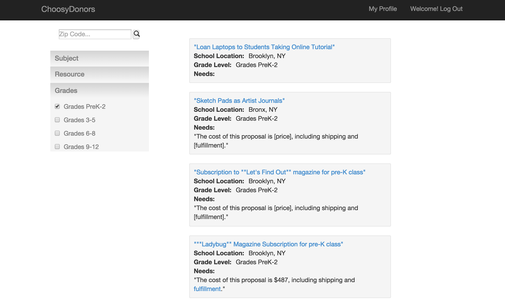

ChoosyDonors
================

####Project Description


ChoosyDonors simplifies the process of selecting projects that users are interested in from <a href="www.donorschoose.org">DonorsChoose</a>, a crowdfunding website for teachers to get funding for projects they want to do with their students. Working with data from DonorsChoose, the app uses natural language processing and machine learning (k-means clustering) to create clusters of similar projects that users can select to create donation portfolios for easy lump donations.  ChoosyDonors also calculates an impact score based on multiple criteria to help assess need at the project's school.

ChoosyDonors was built by Linda Zhou in November 2014, as her capstone project for <a href="www.hackbrightacademy.com">Hackbright Academy</a>.


###Contents
<ul>
	<li><a href="#features">Features</a></li>
	<li><a href="#technologies">Technologies</a></li>
		<ul>
			<li><a href="#clustering">Clustering</a></li>
			<li><a href="#data-visualization">Impact Score & Data Visualization</a></li>
			<li><a href="#database">Database</a></li>
		</ul>
	<li><a href="#structure-of-files">Structure of Files</a></li>
	<li><a href="#data-sources">Data Sources</a></li>
</ul>


Features
----------------

<h4>The homepage:</h4>
<ul>
	<li>User selects how he/she wants to select projects</li>
</ul>


<h4>Creating a donation portfolio:</h4>
<ul>
	<li>User first selects a theme for the portfolio.</li>
	<li>After the user indicates the size of the portfolio, the app will randomly select that many projects from that cluster.</li>
	<li>Then, the user can select the ones he/she likes and save them to a portfolio that can be accessed from his/her profile.</li>
</ul>


<h4>Single Project Search:</h4>
<ul>
	<li>Users can also search through the database for specific projects.</li>
	<li>Selecting a filter will immediately refine the search results the user sees.</li>
</ul>



<h4>Search by Impact:</h4>
<ul>
	<li>Users can maximise their impact based on the level of financial need of a school by choosing a project using this map view. Darker regions reflect greater need.</li>
	<li>Impact scores were assigned to all schools based on percent of students with free-reduced lunch, graduation rates, percent of students taking the SAT, teacher to student ratios, poverty and crime rates for those regions. </li>
</ul>


Technologies
------------------------
Python, SQLite, SQLAlchemy, NLTK, Scikit-learn, Flask, Jinja, Javascript, jQuery, AJAX, d3.js, GoogleMaps API, beautifulsoup, HTML, CSS, Twitter Bootstrap

#####Clustering
The need data provided by teachers was processed using NLTK to remove all punctuation and stem all words.  Stop words were removed and tf-idf analysis was performed in order to find the key words for each project in the need data.  Projects were then grouped into various themes using k-means clustering (scikit-learn) based on the tf-idf weights.

#####Impact Score & Data Visualization
The impact score is a composite score based on the graduation rates, teacher-student ratios, percent of students taking the SAT, percent of students with free or reduced lunch, poverty levels, and crime levels for the region a school is located in.  Some of the data had to be acquired by scraping location data websites.  The data was then normalized and the impact score was calculated based on the normalized data where each factor was weighted equally.  

The set of impact scores were then translated into a choropleth map using <a href="http://bl.ocks.org/jefffriesen/6892860">jefffriesen</a>'s d3.js visualization of US zip codes.  The SVG was overlaid on GoogleMaps and a randomly selected sampling of 1000 projects is displayed on the map as markers.  GoogleMaps' MarkerClusterer library was used to prevent visual overload and improve the overall user experience.

#####Database
The SQLite database uses SQLAlchemy as its ORM and contains 10 tables with 3gb of data on 600,000+ projects.


Structure of Files
-----------------------

The main files of ChoosyDonors are:
<ul>
    <li>```model.py```: This file creates the database and defines the classes that map to the database tables.</li>
    <li>```app.py```: This is the heart of the app. It contains all the routes, queries & updates the database, and feeds information to the front end.</li>
    <li>```cluster.py```: This file performs natural language processing & tf-idf on the need data for all projects and uses k-means clustering to form the clusters for donation portfolios.</li>
    <li>```seed.py```: This file seeds the database.</li>
    <li>```calc_impact.py```: This is a script to calculate the impact scores based on various regional factors.</li>
    <li>```crime_scrape.py``` & ```tablescraper.py```: These were the scripts to scrape regional data off location data websites.</li>
    <li>```projects.db```: This is the sqlite3 database for the app. It 
        is not included in this repository, but the files to set up a similar 
        database are included here (```model.py```).
    <li>**CSS files:** These files (saved in the ```static``` folder) control 
        the styling of the HTML pages. </li>
    <li>**HTML templates:** These files (saved in the ```templates``` folder) 
        are the pages of the app.</li>
    <li>**JS files:** These files (saved in the ```static``` folder) allow projects to be loaded in the app without the entire page having to reload.</li>
</ul>


Data Sources
-----------------------
<ul>
	<li>The bulk of the data used is available on the DonorsChoose website in <a href="http://data.donorschoose.org/open-data/overview/">csv form</a>.</li>
	<li>The education related data for the impact scores is available from the <a href="http://nces.ed.gov/programs/digest/">National Center for Education Statistics</a>.</li>
	<li>Poverty data for neighborhoods in the US can be found on <a href="http://zipatlas.com/us/zip-code-comparison/population-below-poverty-level.htm">Zipatlas</a>.</li>
	<li>Crime data for neighborhoods in the US can be found on <a href="http://www.city-data.com/crime/">City-Data</a>.</li>
</ul>

-----------------------
> Learn more about the developer by visiting her <a href="https://www.linkedin.com/in/lzhou2">LinkedIn</a>.